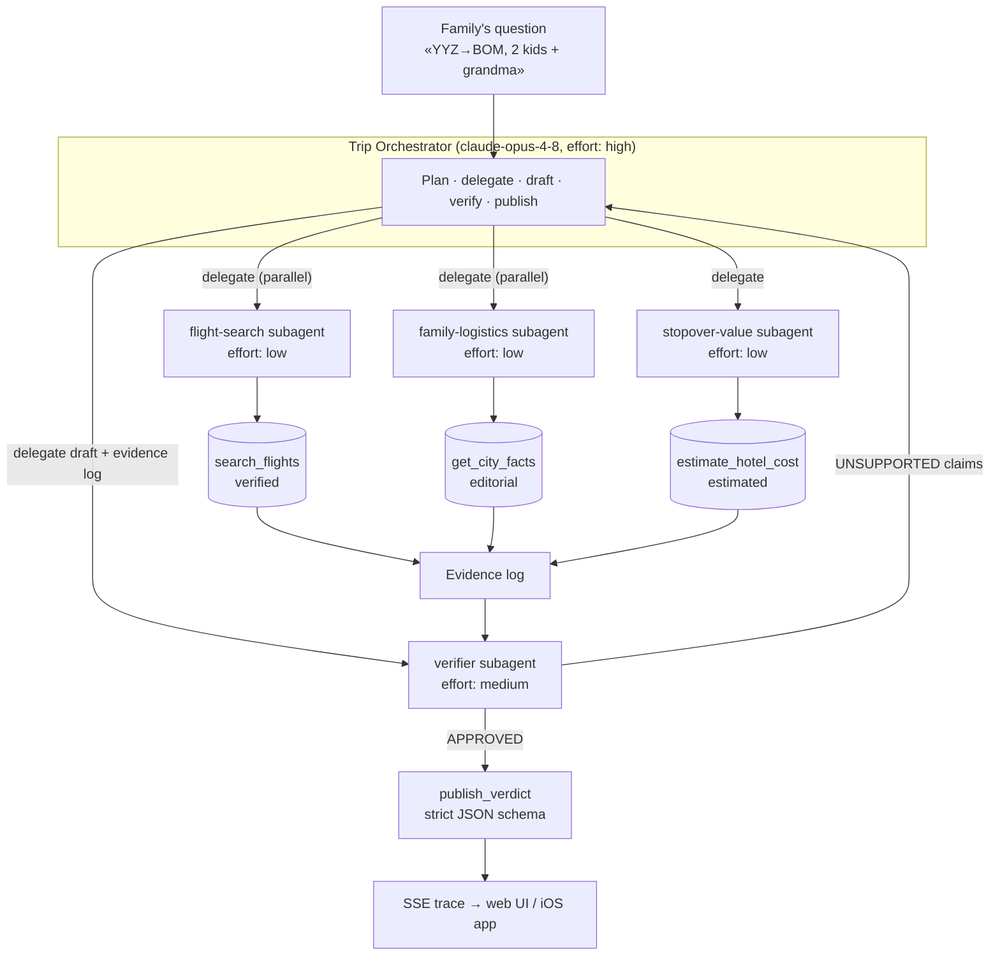

# FlyWith Agent — orchestrator + subagent architecture

The agentic core of FlyWith: a **trip orchestrator** that decomposes a family's
long-haul travel question, delegates to four specialist **subagents**, and may
not publish an answer until a **verifier** has audited every claim against the
raw tool evidence. Built directly on the Anthropic TypeScript SDK — the
orchestration loop is owned by this code, not hidden behind a framework, so
every architectural decision is visible and defensible.

## Architecture



## Design decisions (the capstone rationale)

**Orchestrator–worker over a fixed pipeline.** The steps *are* mostly known
(price → assess → score → verify), but which stopover cities matter, whether a
visa showstopper kills a candidate early, and whether re-verification is needed
are runtime decisions. The orchestrator makes them; a pipeline can't.

**Context isolation per subagent.** Each subagent runs its own Messages loop
with its own system prompt and only its own tools. The flight agent never sees
visa editorial; the logistics agent never sees fares. This keeps each context
small (cheap + focused) and makes reports auditable — a number can only have
come from that agent's tools.

**Parallel fan-out where work is independent.** Flight search and family
logistics have no data dependency, so the orchestrator issues both `delegate`
calls in one turn and they run under `Promise.all`. Stopover-value waits for
flight numbers; the verifier waits for everything. The dependency graph is in
the prompt, the mechanism is in the loop.

**A critic that gates output.** Every tool result is appended to an evidence
log tagged `verified` / `estimated` / `editorial`. The verifier subagent
receives the draft verdict *plus the raw log* and classifies every claim.
`publish_verdict` is only legal after approval. This mechanizes FlyWith's core
product rule (from `docs/real-app-roadmap.md`): editorial estimates are never
presented as verified live data.

**Structured output at the boundary.** The verdict leaves the system through a
`strict: true` tool schema, so the web UI and iOS app render typed data, not
parsed prose.

**Effort as a cost dial.** The orchestrator runs at `effort: high` (it plans);
mechanical subagents run at `low`; the verifier at `medium` (judgment, but
narrow scope). One model, tiered spend.

## Run it

```bash
cd agent
npm install
export ANTHROPIC_API_KEY=sk-ant-...
npm run dev
# open http://localhost:8787 — type a trip, watch the agents work
```

`GET /api/plan?prompt=...` streams Server-Sent Events: orchestrator thinking,
subagent starts, every tool call and result, subagent reports, and the final
structured verdict. `demo.html` is a minimal client for that stream.

## Demo vs live data

The tool layer (`src/data.ts`) currently serves the June 2026 fare snapshot
from the repo README and editorial city facts from the market research docs —
so the demo runs without flight-API keys and inside their rate limits. The
orchestration layer never touches data directly; swapping `data.ts` for the
LetsFG client (see `FlyWith/Services/FlightService.swift` for the async
search/poll pattern) upgrades the whole system to live fares without changing
a single agent.

## Files

| File | What it is |
|---|---|
| `src/orchestrator.ts` | The main loop: delegate tool, parallel fan-out, verifier gate, `publish_verdict` |
| `src/subagents.ts` | Subagent definitions (system prompts, tool subsets, effort tiers) + their run loop |
| `src/data.ts` | Demo dataset behind the tools — the swap point for live APIs |
| `src/trace.ts` | Trace event types + evidence log types |
| `src/server.ts` | HTTP + SSE server |
| `demo.html` | Minimal live-trace client |
